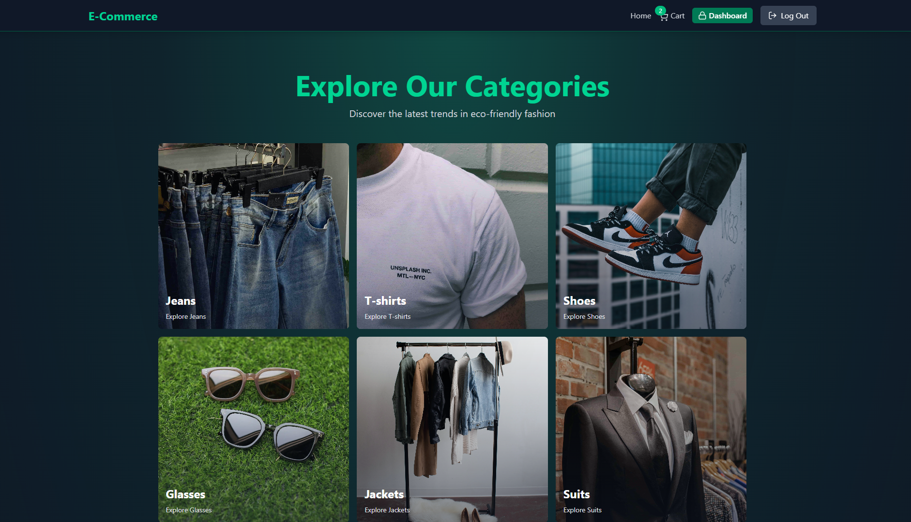
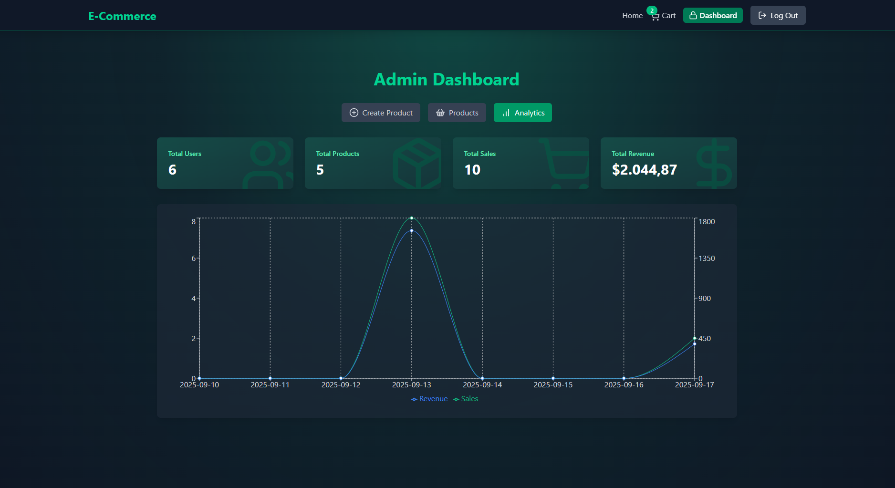

# MERN E-Commerce 🛍️✨




## 📌 Table of Contents

- [MERN E-Commerce 🛍️✨](#mern-e-commerce-️)
  - [📌 Table of Contents](#-table-of-contents)
  - [🌐 Overview](#-overview)
  - [⚙️ Features](#️-features)
  - [💻 Technologies Used](#-technologies-used)
      - [🔙 **Backend**](#-backend)
      - [🌐 **Frontend**](#-frontend)
      - [🔐 **Auth \& Security**](#-auth--security)
      - [🧰 **Dev Tools**](#-dev-tools)
  - [🗝️ Key Takeaways](#️-key-takeaways)
  - [🚀 How to Run the Project](#-how-to-run-the-project)
    - [Prerequisites](#prerequisites)
    - [Install \& run (development)](#install--run-development)
    - [Build \& Start (production)](#build--start-production)
  - [📄 Environment Variables](#-environment-variables)
  - [🛠️ API Endpoints](#️-api-endpoints)
  - [🤝 Contributing](#-contributing)
  - [💬 Contact](#-contact)

## 🌐 Overview

MERN E-Commerce is a full-stack TypeScript application implementing a modern online shop: user auth (access + refresh tokens with Redis), cart management, Stripe Checkout, coupon generation/validation, Cloudinary image uploads, Redis caching for featured products, admin product management and analytics.  
Backend is an Express + TypeScript app (`/backend`) and frontend is React + Vite + TypeScript (`/frontend`).

## ⚙️ Features

- **Auth & Sessions**: Signup/login, httpOnly access & refresh tokens, refresh tokens stored in Redis.
- **Product management**: Admin CRUD for products, Cloudinary image upload, toggle featured.
- **Cart**: add/remove items, update quantity, fetch cart items populated with product info.
- **Stripe Checkout**: create checkout sessions, success handling creates orders and deactivates coupons.
- **Coupons**: per-user coupon, validation, expiration handling and Stripe coupon sync.
- **Caching & Performance**: Redis cache for featured products and token store.
- **Analytics**: totals (users, products, sales, revenue) and daily sales aggregation.
- **Security**: Helmet CSP configured for Stripe & Cloudinary, CORS, cookie flags, JSON limits.
- **Frontend UX**: Zustand stores, axios with refresh interceptor, protected routes, responsive UI.

## 💻 Technologies Used

#### 🔙 **Backend**

- [**Node.js**](https://nodejs.org/) – JavaScript runtime for building fast and scalable server-side applications.
- [**Express**](https://expressjs.com/) – Minimal and flexible Node.js web application framework.
- [**TypeScript**](https://www.typescriptlang.org/) – Strongly typed superset of JavaScript that enhances code quality and developer experience.
- [**Mongoose**](https://mongoosejs.com/) – Elegant MongoDB object modeling for Node.js.
- [**MongoDB**](https://www.mongodb.com/) – NoSQL database used for storing products, users, orders, and more.
- [**ioredis**](https://github.com/luin/ioredis) – Redis client for Node.js, used for caching and session/token storage.
- [**Stripe**](https://stripe.com/) – Payment platform used to handle checkout sessions and transactions.
- [**Cloudinary**](https://cloudinary.com/) – Cloud-based image hosting and transformation service, used for storing and optimizing product images.

#### 🌐 **Frontend**

- [**React**](https://reactjs.org/) – Component-based library for building interactive UIs.
- [**Vite**](https://vitejs.dev/) – Fast development build tool for modern web apps.
- [**TypeScript**](https://www.typescriptlang.org/) – Strong typing for better developer tooling and fewer bugs.
- [**Tailwind CSS**](https://tailwindcss.com/) – Utility-first CSS framework for rapidly building custom designs.
- [**Zustand**](https://github.com/pmndrs/zustand) – Lightweight, minimal state-management solution for React.
- [**React Router**](https://reactrouter.com/) – Declarative routing for React applications.
- [**React Hot Toast**](https://react-hot-toast.com/) – Lightweight, customizable toast notifications for user feedback.
- [**Recharts**](https://recharts.org/en-US/) – Charting library for building customizable data visualizations.

#### 🔐 **Auth & Security**

- [**JWT**](https://jwt.io/) – JSON Web Tokens used for access and refresh token-based authentication.
- **httpOnly Cookies** – Used for securely storing refresh tokens in the browser, inaccessible to JavaScript.
- [**Helmet**](https://helmetjs.github.io/) – Secures Express apps by setting various HTTP headers.
- [**CORS**](https://developer.mozilla.org/en-US/docs/Web/HTTP/CORS) – Mechanism to allow controlled access to resources from different domains.

#### 🧰 **Dev Tools**

- [**tsx**](https://github.com/esbuild-kit/tsx) – Instant TypeScript execution for Node.js using esbuild.
- [**Vite**](https://vitejs.dev/) – Lightning-fast dev server and build tool (also listed in frontend).
- [**ESLint**](https://eslint.org/) – Pluggable linting utility for identifying and fixing problems in code.
- [**TypeScript**](https://www.typescriptlang.org/) – Repeated for emphasis; used both client and server side for type safety.

## 🗝️ Key Takeaways

1. **Secure session flow**: short-lived access tokens + refresh tokens stored in Redis.
2. **Server-authoritative payments**: Stripe sessions → server verifies and persists orders.
3. **Cache-first reads**: Redis improves performance for featured products.
4. **Clean separation**: controllers for logic, routes for endpoints, models for schema.
5. **Robust frontend flow**: global token refresh + optimistic UX with Zustand.

## 🚀 How to Run the Project

### Prerequisites

- Node.js (v18+ recommended) & npm
- MongoDB (Atlas or local)
- Redis (Upstash or local)
- Cloudinary account (optional for images)
- Stripe account (test keys ok)

### Install & run (development)

1. Clone repository:

   ```bash
   git clone https://github.com/Cauebf/mern-ecommerce.git
   cd mern-ecommerce
   ```

2. Install dependencies:

   ```bash
   npm install
   npm install --prefix frontend
   ```

3. Create .env [(see next section)](#-environment-variables).

4. Start backend (with tsx watch):

   ```bash
   npm run dev
   ```

5. Start frontend (in another terminal):

   ```bash
   cd frontend
   npm run dev
   ```

   Frontend default: http://localhost:5173

   Backend default: http://localhost:5000 (or the `PORT` from `.env`)

### Build & Start (production)

From project root:

```bash
npm run build
npm run start
```

- `npm run build` installs frontend deps, builds frontend, compiles backend TS into `backend/dist`.
- `npm run start` runs `node backend/dist/server.js` and — when `NODE_ENV !== "development"` — serves the frontend build from `frontend/dist`.

## 📄 Environment Variables

Create a `.env` in the project root:

```bash
PORT=5000
NODE_ENV=development

MONGO_URI=mongodb+srv://<user>:<pass>@cluster0.mongodb.net/dbname

UPSTASH_REDIS_URL=redis://<...>

ACCESS_TOKEN_SECRET=your_access_token_secret
REFRESH_TOKEN_SECRET=your_refresh_token_secret

CLOUDINARY_CLOUD_NAME=your_cloud_name
CLOUDINARY_API_KEY=your_api_key
CLOUDINARY_API_SECRET=your_api_secret

STRIPE_SECRET_KEY=sk_test_...
CLIENT_URL=http://localhost:5173
```

Frontend (client-only) `.env`:

```bash
# frontend/.env
VITE_STRIPE_PUBLISHABLE_KEY=pk_test_...
```

## 🛠️ API Endpoints

> All routes are mounted under `/api/...`. Protected routes require the `protectedRoute` middleware (valid access token cookie). Admin-only routes also require `adminRoute`.

- **Auth**

  - `POST /signup` — Register new user and set auth cookies.
  - `POST /login` — Log in user and return user data with cookies.
  - `POST /logout` — Logout user and clear cookies. _(Protected)_
  - `POST /refresh-token` — Refresh access token using cookie.
  - `GET /profile` — Get current user profile. _(Protected)_

- **Products**

  - `GET /products` — Get all products. _(Protected, Admin only)_
  - `GET /products/featured` — Get featured products (cached).
  - `GET /products/category/:category` — Get products by category.
  - `GET /products/recommendations` — Get recommended products.
  - `POST /products` — Create a new product. _(Protected, Admin only)_
  - `PATCH /products/:id` — Toggle featured status. _(Protected, Admin only)_
  - `DELETE /products/:id` — Delete product and image. _(Protected, Admin only)_

- **Cart**

  - `GET /cart` — Get current user's cart. _(Protected)_
  - `POST /cart` — Add or increment product in cart. _(Protected)_
  - `DELETE /cart` — Remove product or clear cart. _(Protected)_
  - `PUT /cart/:id` — Update item quantity. _(Protected)_

- **Coupons**

  - `GET /coupons` — Get active coupon. _(Protected)_
  - `POST /coupons/validate` — Validate coupon code. _(Protected)_

- **Payments**
  - `POST /payments/create-checkout-session` — Start Stripe checkout. _(Protected)_
  - `POST /payments/checkout-success` — Confirm payment and create order. _(Protected)_

## 🤝 Contributing

Contributions are welcome!

1. Fork the repo
2. Create branch: `git checkout -b feat/your-feature`
3. Commit: `git commit -m "feat: your feature"`
4. Push & open a PR

Please test major flows (signup/login, checkout, admin product actions) before submitting PRs.

## 💬 Contact

For any inquiries or collaboration opportunities, feel free to reach out via:

[](mailto:cauebrolesef@gmail.com)
[](https://www.linkedin.com/in/cauebrolesef/)
[](https://www.instagram.com/cauebf_/)
[](https://github.com/Cauebf)

<p align="right">(<a href="#mern-e-commerce-️">back to top</a>)</p>
